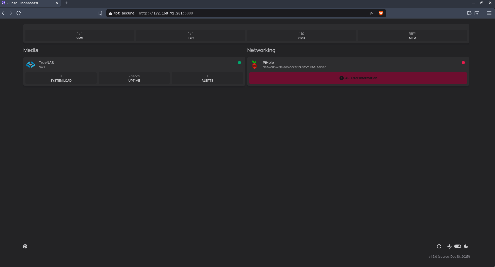

# Homepage

Homepage is a dashboard service run directly on the **Pi 2 W**, this branch contains the `/config` folder of the `/opt/homepage/` folder.

## Preview



## Installation

1. To get started installing homepage we follow [these instructions](https://gethomepage.dev/installation/source/). We start by cloning the repo in the right place:
    ```
    cd /opt/
    git clone https://github.com/gethomepage/homepage.git
    ```

2. Now we need to install `npm` and `pnpm` if they're not already installed:
    ```
    sudo apt install npm
    npm install -g pnpm
    ```

3. Now install the required dependencies for this project:
    ```
    pnpm install
    ```
    This command may fail due to running out of heap memory. It'll end with a `Killed` message. If you wish to "create" more heap memory you need to create a swapfile (2GB works pretty well).
    ```
    sudo fallocate -l 2G /swapfile
    sudo chmod 600 /swapfile
    sudo mkswap /swapfile
    sudo swapon /swapfile 
    ```
    And for extra safety run the command with this option:
    ```
    NODE_OPTIONS="--max-old-space-size=512" pnpm install 
    ```

4. Now we can start building homepage:
    ```
    pnpm build
    ```
    If this command also fails also run this command with these options:
    ```
    NODE_OPTIONS="--max-old-space-size=512" pnpm build 
    ```
   
5. Remove `/opt/homepage/config` folder.

6. Clone the repository into the `/opt/homepage/config` folder:
    ```
    git clone https://github.com/Ggjorven/homelab.git -b homepage /opt/homepage/config
    ```

7. Create or modify the `.env` in `/opt/homepage/` following this format replacing the placeholders with actual values.
    ```
    HOMEPAGE_ALLOWED_HOSTS=192.168.x.x:3000

    HOMEPAGE_VAR_PROXMOX_IP=192.168.x.x
    HOMEPAGE_VAR_PROXMOX_URL=https://192.168.x.x:8006
    HOMEPAGE_VAR_PROXMOX_USERNAME=xxxxx@pam!xxxxx
    HOMEPAGE_VAR_PROXMOX_SECRET=

    HOMEPAGE_VAR_TRUENAS_IP=192.168.x.x
    HOMEPAGE_VAR_TRUENAS_URL=https://192.168.x.x
    HOMEPAGE_VAR_TRUENAS_USERNAME=
    HOMEPAGE_VAR_TRUENAS_PASSWORD=

    HOMEPAGE_VAR_PIHOLE_IP=192.168.x.x
    HOMEPAGE_VAR_PIHOLE_URL=https://192.168.x.x
    HOMEPAGE_VAR_PIHOLE_PASSWORD=
    ```

8. To make this start on bootup we need to install a systemctl service. I have created one. Use this command to create the service:
    ```
    cd /etc/systemd/system
    wget https://raw.githubusercontent.com/Ggjorven/homelab/refs/heads/homepage/services/start-homepage.service
    ```

9. Now we just need to enable it:
    ```
    systemctl daemon-reload
    systemctl enable start-homepage
    systemctl start start-homepage
    ```

## Contributing

Contributions are welcome! Please fork the repository and create a pull request with your changes.

## References

- [Proxmox](https://www.proxmox.com) - Hypervisor
- [Homepage](https://github.com/gethomepage/homepage) - Dashboard
