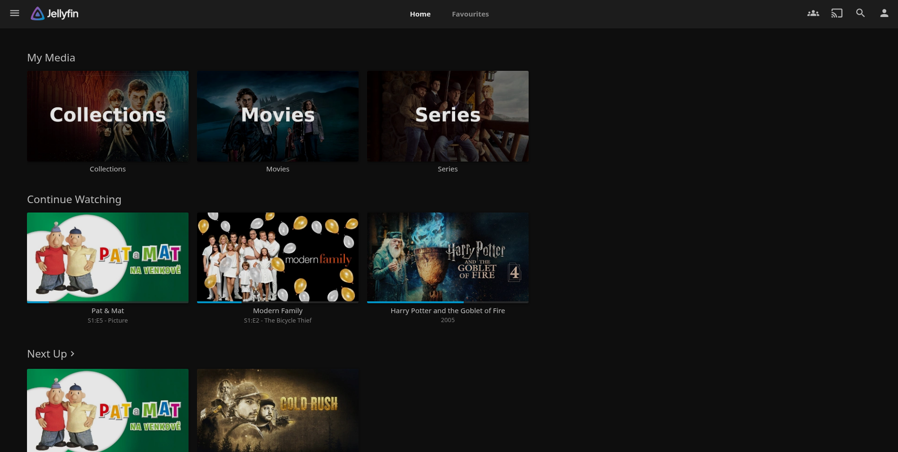

# Jellystack

**Jellystack** is a collection of media streaming tools for streaming my content from any device, this branch contains the installation instructions for installing **Jellyfin & More** using **Docker Compose**.

## Preview



## Preparation

Before you can get started you must ensure NVIDIA drivers are installed on the host system:
This is done using the following steps:  
These steps have been taken from [here](https://forum.proxmox.com/threads/nvidia-drivers-instalation-proxmox-and-ct.156421/).

1. Blacklist the nouveau drivers (this will create a new file):
   ```
   nano /etc/modprobe.d/blacklist-nouveau.conf
   ```
   Paste this inside:
   ```
   blacklist nouveau
   options nouveau modeset=0
   ```

2. Update initramfs:
   ```
   update-initramfs -u
   ```

3. Check if nouveau is enabled
   ```
   lsmod | grep nouveau
   ```
   If it gives output, disable it with the following command:
   ```
   rmmod nouveau
   ```
   Afterwards go back and verify it's actually disabled by running the following command again:
   ```
   lsmod | grep nouveau
   ```

4. Make sure your system can find your NVIDIA GPU:
   ```
   lspci | grep NVIDIA
   ```

5. Download the latest nvidia driver for your GPU [link](https://www.nvidia.com/en-us/drivers/) where the OS is **Linux 64-bit**. Example:
   ```
   wget https://us.download.nvidia.com/XFree86/Linux-x86_64/550.90.07/NVIDIA-Linux-x86_64-550.90.07.run
   chmod +x NVIDIA-Linux-x86_64-550.90.07.run
   ```

6. Install the required build packages:
   ```
   apt install build-essential pve-headers-$(uname -r)
   ```

7. Run the installation:
   ```
   ./NVIDIA-Linux-x86_64-550.90.07.run
   ```

8. Verify the drivers installed succesfully:
   ```
   nvidia-smi
   ```
   If you don't get any output. Restart your LXC

10. Now make we need to make sure that the NVIDIA drivers persist. We do so using a **systemctl service** on the main node. I have created a nice script for this you can get with this command:
    ```
    cd /etc/systemd/system
    wget https://raw.githubusercontent.com/Ggjorven/homelab/refs/heads/jellyfin/services/nvidia-persistence.service
    mkdir /root/scripts
    cd /root/scripts
    wget https://raw.githubusercontent.com/Ggjorven/homelab/refs/heads/jellyfin/scripts/nvidia-persistence.sh
    chmod +x nvidia-persistence.sh
    ```

11. Lastly we need to enable this service with:
    ```
    systemctl daemon-reload
    systemctl enable nvidia-persistence
    systemctl start nvidia-persistence
    ```

Before LXC container can access our SMB share we need to mount it to the root node and pass it through with these steps:
*If you have completed these steps from [jellyfin](https://github.com/Ggjorven/homelab/tree/jellyfin) before you can head straight to **Installation**.*

1. Install the following packages to help with mounting:
    ```
    apt install cifs-utils smbclient
    ```

2. Next we need to setup our credentials for our SMB share. We do this in the file `/root/.smbcred`.
    ```
    nano /root/.smbcred 
    ```

3. Paste in the following content and replace the placeholders with your actual `username` and `password`.
    ```
    username=<YOUR USERNAME FOR SMB>
    password=<YOUR PASSWORD FOR SMB>
    ```

4. Now we just need to make a service that mounts the TrueNAS **SMB Share** when it becomes available. I have also created a service script for this purpose:
    ```
    cd /etc/systemd/system
    wget https://raw.githubusercontent.com/Ggjorven/homelab/refs/heads/jellyfin/services/mount-smb.service
    mkdir /root/scripts
    cd /root/scripts
    wget https://raw.githubusercontent.com/Ggjorven/homelab/refs/heads/jellyfin/scripts/mount-smb.sh 
    chmod +x /root/scripts/mount-smb.sh
    ```

5. Edit the `/root/scripts/mount-smb.sh` script and replace the `SERVER_IP` with your NAS's actual IP. 
    ```
    nano /root/scripts/mount-smb.sh
    ```

6. Now make sure your mount point set in the `/root/scripts/mount-smb.sh` actually exists with:
    ```
    mkdir /mnt/nas
    ```

7. Now we need to enable this service with:
    ```
    systemctl daemon-reload
    systemctl enable mount-smb
    systemctl start mount-smb
    ```

8. To check if the mounting script succeeded run:
   ```
   journalctl -xeu mount-smb.service
   ```
   You should see the output from the script saying that the SMB was successfully mounted.

## Installation

1. From the **Proxmox Node**'s shell install a **Docker LXC** using the [community script](https://community-scripts.github.io/ProxmoxVE/scripts?id=docker):
   ```
   bash -c "$(curl -fsSL https://raw.githubusercontent.com/community-scripts/ProxmoxVE/main/ct/docker.sh)"
   ```

2. To give our **LXC** access to our network share we need to add this line to `/etc/pve/lxc/<CTID>.conf`:
   ```
   nano /etc/pve/lxc/<CTID>.conf
   ```
   Add:
   ```
   mp0: /mnt/nas,mp=/mnt/nas
   ```
   And:
   ```
   lxc.cgroup2.devices.allow: c 10:200 rwm
   lxc.mount.entry: /dev/net dev/net none bind,create=dir
   lxc.mount.entry: /dev/net/tun dev/net/tun none bind,create=file
   ```
   *Note: Also make sure nesting=1 and keyctl=1*

3. After a restart your **Docker LXC** should have `/mnt/nas` mounted. You can check with:
    ```
    ls /mnt
    ```
    You should see `nas` in the output.

4. Before our GPU is actually visible in the LXC we need to also install GPU drivers in the LXC. Make sure you download the exact same drivers as before. This requires `wget`.
   ```
   apt install wget
   ```
   
5. Now install the exact same drivers as before:
   ```
   wget https://us.download.nvidia.com/XFree86/Linux-x86_64/550.90.07/NVIDIA-Linux-x86_64-550.90.07.run
   chmod +x NVIDIA-Linux-x86_64-550.90.07.run
   ```

6. But now we need to install it with a different command, make sure to add the `--no-kernel-module` flag:
   ```
   ./NVIDIA-Linux-x86_64-550.90.07.run --no-kernel-module
   ```
   
7. Make sure your LXC sees the drivers with:
   ```
   nvidia-smi
   ```
   You should see your GPU listed.

8. Now we have to give docker access to our GPU. To do this we need to install the nvidia-runtime, before we can do so we need to add the NVIDIA repository. We'll start by adding the GPG key:
   ```
   mkdir -p /usr/share/keyrings
   curl -fsSL https://nvidia.github.io/libnvidia-container/gpgkey | sudo gpg --dearmor -o /usr/share/keyrings/nvidia-container-toolkit-keyring.gpg
   ```

9. Now we'll add the repository:
   ```
   distribution=$(. /etc/os-release;echo $ID$VERSION_ID)
   curl -s -L https://nvidia.github.io/libnvidia-container/stable/deb/nvidia-container-toolkit.list | \
   sed 's#deb https://#deb [signed-by=/usr/share/keyrings/nvidia-container-toolkit-keyring.gpg] https://#g' | \
   tee /etc/apt/sources.list.d/nvidia-container-toolkit.list
   ```
   
10. Now install the container toolkit:
    ```
    sudo apt update
    sudo apt install -y nvidia-container-toolkit
    ```

11. Configure docker to use the NVIDIA runtime:
    ```
    nvidia-ctk runtime configure --runtime=docker
    systemctl restart docker
    ```

12. Verify its install with:
    ```
    docker info | grep -i runtime
    ```
    You should see:
    ```
    Runtimes: runc io.containerd.runc.v2 nvidia
    ```

13. Now we can actually start setting up the docker stack. We first need to create a nice place to work in:
    ```
    mkdir -p /docker
    ```

14. To create the docker stack we use our premade [compose file](https://github.com/Ggjorven/homelab/blob/jellystack/jellystack.yaml). But before we can do so we need to install `wget`.
    ```
    apt install wget
    ```
    Now we can run:
    ```
    cd /docker
    wget https://raw.githubusercontent.com/Ggjorven/homelab/refs/heads/jellystack/jellystack.yaml
    ```

15. Now modify your `.env` file.
    ```
    nano .env
    ```
    And make sure this is present:
    ```
    # General UID/GIU and Timezone
    TZ=Europe/Amsterdam
    PUID=1000
    PGID=1000

    # Database credentials
    JELLYSTAT_POSTGRES_USER=username
    JELLYSTAT_POSTGRES_PASSWORD=password
    JELLYSTAT_JWT_SECRET=secret
    ```

16. Also make sure the `PUID` and `PGID` are set to your actual IDs in `.env` you can check this with this command *(your user is probably `root`)*:
    ```
    id <YOUR USER>
    ```
    If you run into errors also check [this](https://github.com/TechHutTV/homelab/tree/main/media#user-permissions).

17. We are now finally ready to start our docker stack.
    ```
    docker compose -f gluetun.yaml -f arrstack.yaml -f jellystack.yaml up -d
    ```

*If you have any issues like*:
```
Error response from daemon: failed to create task for container: failed to create shim task: OCI runtime create failed: runc create failed: unable to start container process: error during container init: error running prestart hook #0: exit status 1, stdout: , stderr: Auto-detected mode as 'legacy'
nvidia-container-cli: mount error: failed to add device rules: unable to find any existing device filters attached to the cgroup: bpf_prog_query(BPF_CGROUP_DEVICE) failed: operation not permitted
```
*Checkout [this comment](https://github.com/NVIDIA/nvidia-container-toolkit/issues/1246#issuecomment-3194219487)*

## Configuration

### Jellyfin

To configure **Jellyfin** you need to go to port `8096` of the ip address of the **Proxmox LXC**.

#### Settings

// TODO: Settings instructions

If you use a seperate drive for transcoding, cache and metadata. Make sure to give it the right permissions like so:
```
chmod -R 777 /mnt/jellyfin-cache
```

#### Plugins

**Jellyfin** has an awesome plugin system with plenty of awesome plugins, [examples](https://github.com/awesome-jellyfin/awesome-jellyfin). In my **Jellyfin** deployment I run a lot of plugins listed below:

##### File Tranformation

Configuration steps:

1. Add the manifest listed below these steps to the repositories under **Dashboard** -> **Plugins** -> **Manage Repositories** -> **New Repository**.

###### Manifest:
```
https://www.iamparadox.dev/jellyfin/plugins/manifest.json
```

##### Jellyfin Enhanced

Configuration steps:

1. Add the manifest listed below these steps to the repositories under **Dashboard** -> **Plugins** -> **Manage Repositories** -> **New Repository**.

###### Manifest:
```
https://raw.githubusercontent.com/n00bcodr/jellyfin-plugins/main/10.11/manifest.json
```

##### Jellyfin Tweaks

Configuration steps:

1. Add the manifest listed below these steps to the repositories under **Dashboard** -> **Plugins** -> **Manage Repositories** -> **New Repository**.

###### Manifest:
```
https://raw.githubusercontent.com/n00bcodr/jellyfin-plugins/main/10.11/manifest.json
```

##### Intro Skipper

Configuration steps:

1. Add the manifest listed below these steps to the repositories under **Dashboard** -> **Plugins** -> **Manage Repositories** -> **New Repository**.

###### Manifest:
```
https://intro-skipper.org/manifest.json
```

##### InPlayerEpisodePreview

Configuration steps:

1. Add the manifest listed below these steps to the repositories under **Dashboard** -> **Plugins** -> **Manage Repositories** -> **New Repository**.

###### Manifest:
```
https://raw.githubusercontent.com/Namo2/InPlayerEpisodePreview/master/manifest.json
```

##### Custom Tabs

Configuration steps:

1. Add the manifest listed below these steps to the repositories under **Dashboard** -> **Plugins** -> **Manage Repositories** -> **New Repository**.

###### Manifest:
```
https://www.iamparadox.dev/jellyfin/plugins/manifest.json
```

##### Subtitles Extract

Subtitles Extract is located in the default **Stable Jellyfin** repository.

### Jellyseer

To configure **Jellyseer** we need to go to port `5055` of your **Proxmox LXC**'s IP address.

1.Select **Jellyfin** as the media server type.

2. Now set the URL of **Jellyfin** to `172.39.0.8` as defined in the [compose file](https://github.com/Ggjorven/homelab/blob/jellystack/jellystack.yaml). Leave `URL Base` empty. Set `Email Address` to something random. And choose an appropriate `Username` and `Password`.

3. Now **Sync Libraries**. Both **Movies** and **Series** and **Start the scan**.

4. Continue and set up your **Radarr** server. Make it the `Default Server` and set the `Name` to something like "Radarr". Set the IP address to `172.39.0.4` as defined in the [compose file](https://github.com/Ggjorven/homelab/blob/arrstack/arrstack.yaml). Go to **Radarr** and under `Settings` -> `General` you can find your API key. Finally set `Enable Scan`, `Enable Automatic Search` & `Tag Requests`. Now hit **Test**. And set your desired `Quality Profile` and `Root Folder`.

5. Continue go to **Sonarr**. Make it the `Default Server` and set the `Name` to something like "Radarr". Set the IP address to `172.39.0.3` as defined in the [compose file](https://github.com/Ggjorven/homelab/blob/arrstack/arrstack.yaml). Go to **Sonarr** and under `Settings` -> `General` you can find your API key. Set `Season Folders`, `Enable Scan`, `Enable Automatic Search` & `Tag Requests`. Now hit **Test**. And set your desired `Quality Profile` and `Root Folder`.

6. And finish your setup!

## Final step    

Finally we need to make it so our **Jelly stack** starts on bootup of the **Proxmox LXC**. For ease of use I have created a **systemctl service** and a **bash script** to help with this. You should have installed these when creating the `gluetun` stack. Now modify the script and add:
```
-f jellystack.yaml
```
to it.
To enable this service we run these commands:
```
systemctl daemon-reload
systemctl enable compose-boot
systemctl start compose-boot
```
Now you're all set.

## Contributing

Contributions are welcome! Please fork the repository and create a pull request with your changes.

## References

- [Proxmox](https://www.proxmox.com) - Hypervisor
- [Jellyfin](https://jellyfin.org/) - Media streaming solution
- [Jellyseer](https://docs.seerr.dev/) - Media discovery
