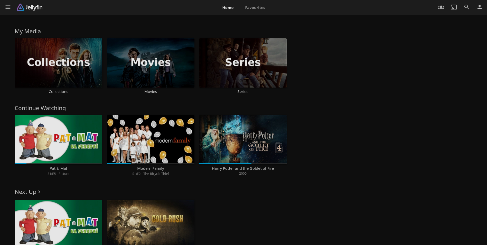

## Preview



## Prerequisites

Before we can create our `media stack` on our `docker` **Proxmox LXC**. We must have finished these steps:

- [`omv`](../../omv/README.md) + extras.
- [`NVIDIA Driver`](../../../tutorials/proxmox/NVIDIA-DRIVERS-NODE.md)
- [`NVIDIA Driver LXC`](../../../tutorials/proxmox/NVIDIA-DRIVERS-LXC.md)
- [`docker`](../README.md)
- [`networkstack`](../networkstack/README.md)
- [`docker NVIDIA runtime`](../../../tutorials/docker/NVIDIA-RUNTIME.md)

## Installation

1. Go to your users `home` directory and go to your dedicated docker directory and create a new directory for `mediastack`:
    ```
    cd ~
    cd docker
    mkdir -p mediastack
    cd mediastack
    ```

2. Retrieve the compose file and .env file:
    ```
    wget https://raw.githubusercontent.com/Ggjorven/homelab/refs/heads/main/main/docker/mediastack/compose.yaml 
    wget https://raw.githubusercontent.com/Ggjorven/homelab/refs/heads/main/main/docker/mediastack/.env
    ```

3. Before we can edit our .env we must identify our user. This is done with:
    ```
    id <yourusername>
    ```
    Take note of `uid` and `gid`.

4. Now open up your .env file:
    ```
    nano .env
    ```

4. Modify `PUID` to reflect your `uid` and `PGID` to reflect `gid`.

5. Now change our postgres credentials to something more secure. ([hint](https://randomkeygen.com/jwt-secret))
    ```
    JELLYSTAT_POSTGRES_USER=username
    JELLYSTAT_POSTGRES_PASSWORD=password
    JELLYSTAT_JWT_SECRET=secret
    ```

6. We are now ready to start our docker stack.
    ```
    docker compose up -d
    ```

## Configuration

### Jellyfin

To configure **Jellyfin** you need to go to port `8096` of the ip address of the **Proxmox LXC**.

#### Settings

To change **Jellyfin**'s settings go to the hamburger menu in the top left and go to **Dashboard**.

##### General

1. Change `cache` path if you use a seperate drive (ex. `/mnt/jellyfin-cache/cache`)
   
2. Change `metadata` path if you use a seperate drive (ex. `/mnt/jellyfin-cache/metadata`)

3. Scroll to the bottom and hit **Save**.

##### Transcoding

1. Set **Hardware Acceleration** to **NVIDIA NVENC**.

2. Enable hardware decoding for (for RTX 3050):
- H264
- HEVC
- MPEG2
- VC1
- VP9
- AV1
- HEVC 10bit
- VP9 10bit

You can what your NVIDIA GPU supports [here](https://en.wikipedia.org/wiki/NVDEC).  
For AMD you can look [here](https://en.wikipedia.org/wiki/Unified_Video_Decoder).  
And intel [here](https://www.intel.com/content/www/us/en/docs/onevpl/developer-reference-media-intel-hardware/1-1/overview.html).

3. Enable **enhanced NVDEC decoder**.

4. Enable hardware encoding and set **Allow encoding in HEVC format**.

5. Change `trancode` path if you use a seperate drive (ex. `/mnt/jellyfin-cache/transcode`)

6. Scroll to the bottom and hit **Save**.

##### Trickplay

1. Enable **hardware decoding**.

2. Scroll to the bottom and hit **Save**.

---

If you use a seperate drive for transcoding, cache and metadata. Make sure to give it the right permissions like so:
```
chown -R 100000:100000 /mnt/jellyfin-cache
chmod -R 777 /mnt/jellyfin-cache
```

#### *Arr Connection

To immediately scan your media library when **Radarr** or **Sonarr** adds something I have created some simple instructions. Repeat these instructions for both **Radarr** and **Sonarr**.

1. Go to your ***Arr** app on port `7878`/`8989` of your **Proxmox LXC**'s IP.

2. Go to `Settings` -> `Connect`.

3. Add a connection and select **Emby / Jellyfin**.

4. Enable the triggers (radarr/sonarr):  
  
    **Radarr**:  
    - On File Import
    - On File Upgrade
    - On Rename
    - On Movie Delete
    - On Movie File Delete
    - On Movie File Delete For Upgrade
    - On Application Update
  
    **Sonarr**:  
    - On File Import
    - On File Upgrade
    - On Import Complete
    - On Rename
    - On Series Delete
    - On Episode File Delete
    - On Episode File Delete For Upgrade
    - On Application Update

5. Set the host IP to `172.39.0.50` as defined in the [compose file](compose.yaml).

6. Go to **Jellyfin** on port `8096` of your **Proxmox LXC**'s IP.

7. Go to `Dashboard` -> `API Keys` and create a key for your ***arr app**. 

8. Paste the key in the **API Key** field.

9. Enable **Update Library**.

10. **Save**!

#### Plugins

**Jellyfin** has an awesome plugin system with plenty of awesome plugins, [examples](https://github.com/awesome-jellyfin/awesome-jellyfin). In my **Jellyfin** deployment I run a lot of plugins listed below:

##### File Tranformation

Configuration steps:

1. Add the manifest listed below these steps to the repositories under **Dashboard** -> **Plugins** -> **Manage Repositories** -> **New Repository**.

###### Manifest:
```
https://www.iamparadox.dev/jellyfin/plugins/manifest.json
```

##### Jellyfin Enhanced

Configuration steps:

1. Add the manifest listed below these steps to the repositories under **Dashboard** -> **Plugins** -> **Manage Repositories** -> **New Repository**.

###### Manifest:
```
https://raw.githubusercontent.com/n00bcodr/jellyfin-plugins/main/10.11/manifest.json
```

##### JavaScript Injector

Configuration steps:

1. Add the manifest listed below these steps to the repositories under **Dashboard** -> **Plugins** -> **Manage Repositories** -> **New Repository**.

###### Manifest:
```
https://raw.githubusercontent.com/n00bcodr/jellyfin-plugins/main/10.11/manifest.json
```

##### Jellyfin Tweaks

Configuration steps:

1. Add the manifest listed below these steps to the repositories under **Dashboard** -> **Plugins** -> **Manage Repositories** -> **New Repository**.

###### Manifest:
```
https://raw.githubusercontent.com/n00bcodr/jellyfin-plugins/main/10.11/manifest.json
```

##### Intro Skipper

Configuration steps:

1. Add the manifest listed below these steps to the repositories under **Dashboard** -> **Plugins** -> **Manage Repositories** -> **New Repository**.

###### Manifest:
```
https://intro-skipper.org/manifest.json
```

##### Segment Editor

Configuration steps:

1. Add the manifest listed below these steps to the repositories under **Dashboard** -> **Plugins** -> **Manage Repositories** -> **New Repository**.

###### Manifest:
```
https://intro-skipper.org/manifest.json
```

##### InPlayerEpisodePreview

Configuration steps:

1. Add the manifest listed below these steps to the repositories under **Dashboard** -> **Plugins** -> **Manage Repositories** -> **New Repository**.

###### Manifest:
```
https://raw.githubusercontent.com/Namo2/InPlayerEpisodePreview/master/manifest.json
```

##### Custom Tabs

Configuration steps:

1. Add the manifest listed below these steps to the repositories under **Dashboard** -> **Plugins** -> **Manage Repositories** -> **New Repository**.

###### Manifest:
```
https://www.iamparadox.dev/jellyfin/plugins/manifest.json
```

##### Streamyfin Companion

Configuration steps:

1. Add the manifest listed below these steps to the repositories under **Dashboard** -> **Plugins** -> **Manage Repositories** -> **New Repository**.

###### Manifest:
```
https://raw.githubusercontent.com/streamyfin/jellyfin-plugin-streamyfin/main/manifest.json
```

##### KefinTweaks

Configuration steps:

1. Go to the **JavaScript Injector** plugin and create a new script and paste:
    ```
    const script = document.createElement("script");
    script.src = `https://cdn.jsdelivr.net/gh/ranaldsgift/KefinTweaks@latest/kefinTweaks-plugin.js`;
    script.async = true;
    document.head.appendChild(script); 
    ```

2. Go to the **Plugins** page and select **KefinTweaks** and select a version and **Install**.

##### Subtitles Extract

Subtitles Extract is located in the default **Stable Jellyfin** repository.

##### Covert Art Archive

Subtitles Extract is located in the default **Stable Jellyfin** repository.

##### TheTVDB

Subtitles Extract is located in the default **Stable Jellyfin** repository.

### Seerr

To configure **Seerr** we need to go to port `5055` of your **Proxmox LXC**'s IP address.

1. Select **Jellyfin** as the media server type.

2. Now set the URL of **Jellyfin** to `172.39.0.50` as defined in the [compose file](compose.yaml). Leave `URL Base` empty. Set `Email Address` to something random. And choose an appropriate `Username` and `Password`.

3. Now **Sync Libraries**. Both **Movies** and **Series** and **Start the scan**.

4. Continue and set up your **Radarr** server. Make it the `Default Server` and set the `Name` to something like "Radarr". Set the IP address to `172.39.0.41` as defined in the [compose file](../arrstack/compose.yaml). Go to **Radarr** and under `Settings` -> `General` you can find your API key. Finally set `Enable Scan` & `Enable Automatic Search`. Now hit **Test**. And set your desired `Quality Profile` and `Root Folder`.

5. Continue go to **Sonarr**. Make it the `Default Server` and set the `Name` to something like "Radarr". Set the IP address to `172.39.0.40` as defined in the [compose file](../arrstack/compose.yaml). Go to **Sonarr** and under `Settings` -> `General` you can find your API key. Set `Season Folders`, `Enable Scan` & `Enable Automatic Search`. Now hit **Test**. And set your desired `Quality Profile` and `Root Folder`.

6. And finish your setup!

7. Now go to `Users` and **Import Jellyfin Users**.

8. Now you can give each user permissions. Click **Edit** and go to `Permissions`.

9. I like to give each user these permissions + the defaults:
    - **Advanced Requests** (for quality selection)
    - **Auto Approve** (for auto approving requests)

10. Finally we'll setup notifications. Go to the **Proxmox LXC**'s IP address on port `8070`.

11. Login with the `username` and `password` set in the .env of `monitoringstack` for **Gotify**.

12. Go to `Apps` and **Create an Application**.

13. Copy the token.

14. Now head back to **Seerr**. Go to `Settings` -> `Notifications` and select **Gotify**.

15. Enable the agent.

16. Set **Server URL** to `http://172.39.0.20:81`

17. Now paste the copied token in **Application Token**.

18. Enable these notification types:
    - **Request Pending Approval**
    - **Request Automatically Approved**
    - **Request Approved**
    - **Request Declined**
    - **Request Available**
    - **Request Processing Failed**
    - **Issue Reported**
    - **Issue Comment**
    - **Issue Resolved**
    - **Issue Reopened**

19. Save changes!

### Streamystats

To configure **Streamystats** we need to go to port `3000` of your **Proxmox LXC**'s IP address.

1. Create a new user for **Jellystat**.

2. Paste the **Jellyfin** address in **Jellyfin URL**: `http://172.39.0.50:8096` as defined in the [compose file](compose.yaml).

3. Now go to **Jellyfin** on port `8096` of **Proxmox LXC**'s IP address. Go to hamburger menu in the top left -> **Dashboard** -> **API Keys** and create a new **API Key** for **Jellystat**.

4. Now go back and paste your **API Key**.

5. Now continue.

6. Login using an administrator account.

7. You're done!

## Start on boot-up

To make this stack start on the boot-up of the LXC follow [these instructions](../BOOT-UP.md#adding-a-stack).

## Debugging

If you have any issues setting up `mediastack` checkout my [debugging guide](DEBUGGING.md). If you still can't figure it out, create a github issue or contact me personally.

## References

- [Docker](https://www.docker.com) - Hardware accelerated containers
- [Jellyfin](https://jellyfin.org/) - Media streaming solution
- [Jellystat](https://github.com/CyferShepard/Jellystat) - Jellyfin statistics
- [Seerr](https://docs.seerr.dev/) - Media discovery
