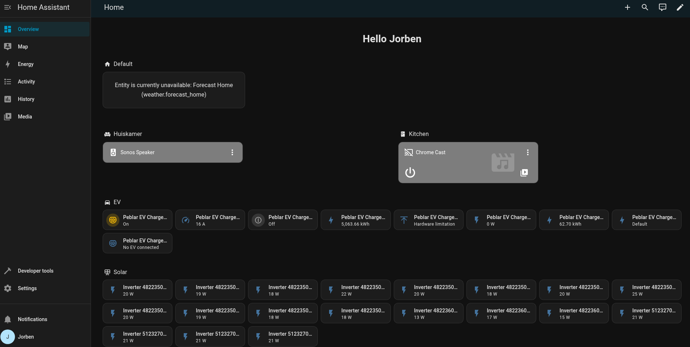

# Home Assistant

**Home Assistant** is a smart home operating system, this branch contains the installation instructions for installing **Home Assistant** as a **Proxmox VM**.

## Preview



## Steps

1. From the **Proxmox** WebUI navigate to the **Node**'s **Shell**.

2. Start creation of the **Home Assistant VM** using the [community script](https://community-scripts.org/scripts/haos-vm):
    ```sh
    bash -c "$(curl -fsSL https://raw.githubusercontent.com/community-scripts/ProxmoxVE/main/vm/haos-vm.sh)"
    ```

3. Proceed with the installation and when asked "Use Default Settings?", choose **Advanced**.

4. Choose the latest **Stable** version.

5. Set the VM ID to `114` (matches with the VLAN).

6. Choose `i440fx` as the **Machine Type**.

7. I have given the `haos` VM a disk of **32GB**, also enable **Disk Cache** when prompted.

8. Set the **Hostname** to `haos` (or something else).

9. Choose **KVM64** as the **CPU Model**.

10. Give the VM **2vCPU**s and **2048MiB** of RAM.

11. For the (primary) **Network Bridge** set it to `vmbr1` and keep the default **MAC Address**.

12. Set the **VLAN tag** to `114` to get the proper firewall rules.

13. Leave **MTU Size** blank.

14. Select don't start the VM when completed. And create!

15. Go to the **Hardware** tab of the **VM** and double click on the **Hard Disk**. Make sure **Advanced Options** are enabled in the bottom right.

16. Disable **SSD emulation**, enable **IO Thread** and set **Cache** to **Write Back**. **Ok**!

17. Also set the **BIOS** to **SeaBIOS**.

18. Click on the **Serial Port** and hit **Remove**.

19. Now hit **Add** and select **Network Device**. Select `vmbr0` and disable the built-in **firewall**. **Add**!

20. Now we can finally start the **VM**, go to the **Console** tab and hit **Start Now**.

21. TODO


2. Now go to the `Console` of the **Home Assistant VM**. We need to install `qemu-guest-agent` to give proxmox control over the VM. This is done with these commands:
  ```
  apt install qemu-guest-agent
  systemctl enable qemu-guest-agent
  ```

4. Now we can start setting up **Home Assistant**. First create your account. The webpage can be found at the **Proxmox VM**'s IP address on port `8123`.

5. If you have any smart devices already they should show up in the final to auto show.

## Configuring

To add more functionality to **Home Assistant** we can use **Home Assistant**'s addons. The addons can be found in the addon store.  
This is located under **Settings** -> **Add-ons** -> **Add-on Store**.

### ESP Home

// TODO: ...

## Debugging

If you have any issues setting up `haos` checkout my [debugging guide](DEBUGGING.md). If you still can't figure it out, create a github issue or contact me personally.

## References

- [Proxmox](https://www.proxmox.com) - Hypervisor
- [Home Assistant](https://www.home-assistant.io/installation/generic-x86-64) - Smart Home OS Installation Guide
- [ESP Home](https://esphome.io/) - Smart Home OS with ESP's
