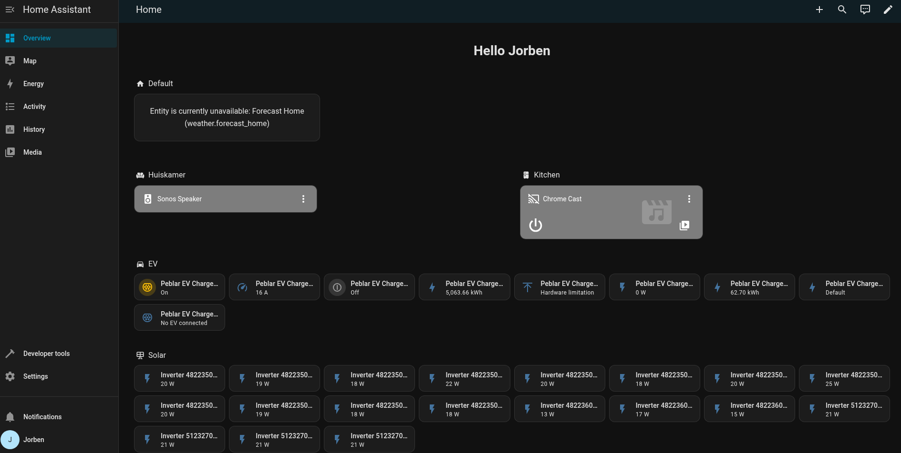

# Home Assistant

**Home Assistant** is a smart home operating system, this branch contains the installation instructions for installing **Home Assistant** as a **Proxmox VM**.

## Preview



## Steps

1. From the **Proxmox Node**'s shell install **Home Assistant** as a **Proxmox VM** using the [community script](https://community-scripts.github.io/ProxmoxVE/scripts?id=haos-vm).
  ```
  bash -c "$(curl -fsSL https://raw.githubusercontent.com/community-scripts/ProxmoxVE/main/vm/haos-vm.sh)"
  ```

2. Now go to the `Console` of the **Home Assistant VM**. We need to install `qemu-guest-agent` to give proxmox control over the VM. This is done with these commands:
  ```
  apt install qemu-guest-agent
  systemctl enable qemu-guest-agent
  ```

3. Now go the `Options` tab and enable `Qemu Guest Agent`.
   
4. Now we can start setting up **Open Media Vault**. First create your account. The webpage can be found at the **Proxmox VM**'s IP address on port `8123`.

5. If you have any smart devices already they should show up in the final to auto show.

## Configuring

To add more functionality to **Home Assistant** we can use **Home Assistant**'s addons. The addons can be found in the addon store.
This is located under `Settings` -> `Add-ons` -> `Add-on Store`.

### ESP Home

// TODO: ...

## Debugging

If you have any issues setting up `home-assistant` checkout my [debugging guide](DEBUGGING.md). If you still can't figure it out, create a github issue or contact me personally.

## References

- [Proxmox](https://www.proxmox.com) - Hypervisor
- [Home Assistant](https://www.home-assistant.io/installation/generic-x86-64) - Smart Home OS Installation Guide
- [ESP Home](https://esphome.io/) - Smart Home OS with ESP's
